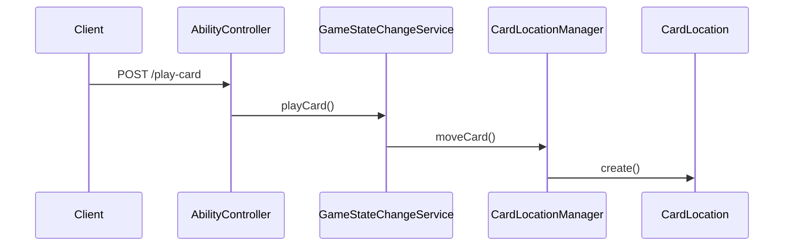
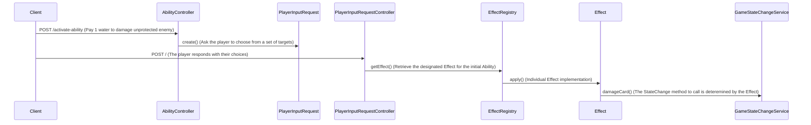

# Ladlands Game System Architecture

## System Overview

This system implements a two-player card game where cards can be:

- Played to the battlefield by paying a wayer cost
- Junked (discarded from a hand) for free to activate their Junk Ability
- Damaged or destroyed during gameplay
- Drawn from or returned to various decks
- Placed in an Event Queue that advances every turn
- Activated on the Battlefield to perform an Ability

## Core Components

### Game State Management

#### Game & GameBoard Models
The `Game` model represents an active game session between two players (playerA and playerOne). Each player has their own `GameBoard` which contains:

- Battlefield (3x3 grid of spaces)
- Event Queue (3 spaces)
- Perma Cards area (2 spaces)

```php
Game -> hasOne(GameBoard) for each player
GameBoard -> hasMany(GameBoardSpace)
```

#### Card Location Tracking
The system uses the `CardLocation` model to track where every card is at any given time. A card can be in one of these locations:
- On a GameBoardSpace
- In a player's hand
- In the Punk deck
- In the discard deck

The `CardLocationManager` service ensures cards can only be in one place at a time and validates all movements.

### Card Types and States

#### Card Model
Cards can be of three types:
- PERSON
- EVENT
- CAMP

Special characteristics:
- Person and Event cards are considered "Punk" cards when:
  - They are in the Punk deck
  - They are face-down on the battlefield
- Camp cards flip over in place when destroyed
- Punk cards return to the Punk deck when damaged

### Effect System

#### Effect Interface
All game actions that modify the game state implement the `Effect` interface:
```php
interface Effect {
    public function getEffectKey(): string;
    public function getSerializedParameters(): array;
    public function apply(GameStateChangeService $stateService, Collection $targets = null): void;
    public function getValidTargetTypes(): array;
    public function getRequiredTargetCount(): int;
}
```

#### Effect Registry
The `EffectRegistry` maintains a list of all available effects and handles their instantiation when needed. This is particularly important for reconstructing effects from serialized PlayerInputRequests.

### Ability System

#### Card Abilities
Cards can have two types of abilities:
1. CardAbilities - activated while on the battlefield
2. JunkAbilities - activated by discarding the card from hand

Both ability types ultimately trigger Effects to modify the game state.

### State Change Management

#### GameStateChangeService
Central service that handles all modifications to the game state. Key responsibilities:
- Damage application
- Card movement between locations
- Water resource management
- Card state changes (face-down, damaged, flipped)

Example of damage handling:
```php
public function damageCard(Card $card): void {
    if ($card->isDamaged()) {
        $this->destroyCard($card);
    } else {
        $card->setDamaged(true);
        if ($card->isPunk()) {
            $this->sendCardToPunkDeck($card);
        }
    }
}
```

### Player Input System

#### PlayerInputRequest
When an Effect requires targeting, a `PlayerInputRequest` is created and stored in the database. This handles the asynchronous nature of player decisions.

Flow:
1. Ability activation -> Effect needs target
2. PlayerInputRequest created with valid targets
3. Player selects targets (async)
4. Effect is reconstructed and applied

## API Layer

### Controllers

#### AbilityController
Handles endpoints for:
- Activating card abilities
- Using junk abilities

```php
POST /api/games/{gameState}/cards/{card}/activate-ability
POST /api/games/{gameState}/cards/{card}/junk
```

#### PlayerInputController
Handles resolution of player input requests:
```php
POST /api/player-input/{playerInputRequest}
GET /api/player-input/{playerInputRequest}/cancel
```

## Common Workflows

### 1. Playing a Card to Battlefield


### 2. Activating a Targeted Ability


## State Views and Visibility

The `GameStateService` generates player-specific views of the game state:
- Players see their own hands but only opponent's hand size
- All battlefield cards are visible (unless face-down)
- Deck sizes are visible to both players

## Testing

The system includes several test suites:
- Unit tests for individual services
- Integration tests for effect resolution
- API tests for controller endpoints
- Feature tests for complete game workflows

## Key Design Benefits

1. **Clear Separation of Concerns**
   - Effects define what can happen
   - GameStateService controls how it happens
   - CardLocationManager ensures valid card movements
   - PlayerInputRequests handle async decisions

2. **Type Safety and Validation**
   - Strong typing throughout the system
   - Validation at both service and database levels
   - Clear boundaries between components

3. **Extensibility**
   - New effects just implement Effect interface
   - Location system can handle new zones
   - Ability system can be extended for new types

4. **Auditability**
   - All card movements tracked with timestamps
   - Clear history of game state changes
   - Player input requests preserved