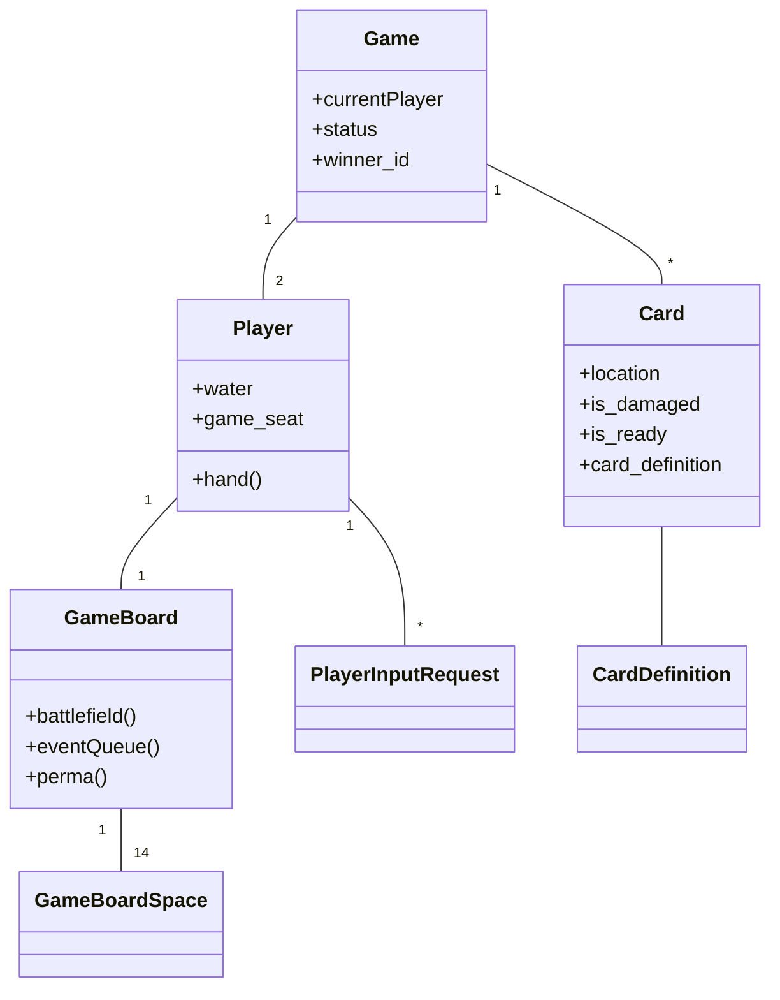
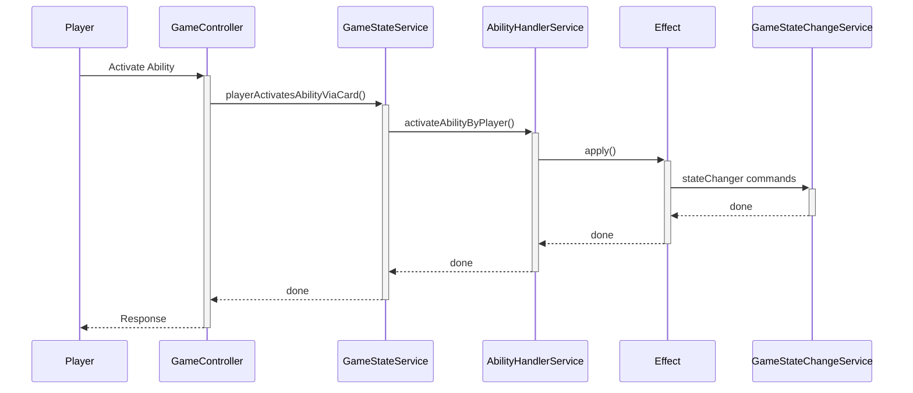
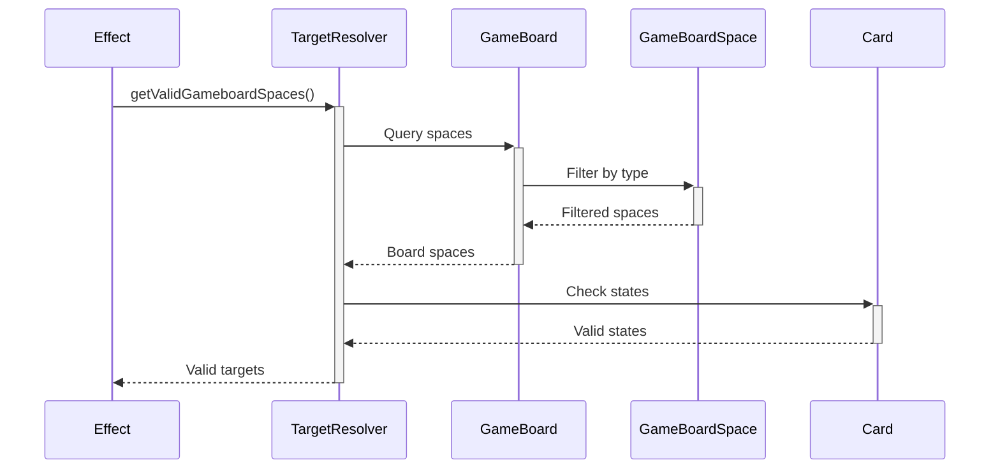

# Ladlands Game System Architecture

## System Architecture Diagrams

### Core Model Relationships


### Effect Resolution Flow


### Targeting Resolution Flow


## Core Game Concepts

Ladlands is a two-player card game where players manage:
- Water (primary resource)
- Cards (in hand, battlefield, and various decks)
- Abilities (on battlefield cards and through discarding)

## System Architecture

### Game State & Board Structure
- Each game has two players (identified as A and One)
- Each player has:
  - A game board with 14 spaces:
    - 9 battlefield spaces (3x3 grid)
    - 3 event spaces
    - 2 permanent card spaces
  - Water resources
  - Hand of cards
  - Input requests queue

### Card System

#### Card Types
- People: Combat units with abilities
- Camps: Support structures that can be damaged/destroyed
- Events: Queue-based effects
- Perma: Special cards (Raiders, Water Silo) in dedicated spaces

#### Card States
- Damaged/Undamaged
- Ready/Not Ready
- Protected/Unprotected (based on board position)
- Regular/Punk (special state for certain cards)

### Core Services

#### GameStateService
Central orchestrator that:
- Manages game flow and turn structure
- Validates and executes player actions
- Tracks card states and locations
- Handles ability activation

#### GameStateChangeService
Handles atomic state changes:
- Card movement between zones
- Damage application
- Resource management
- Card state modifications

#### TargetResolver
Determines valid targets for abilities based on:
- Card location
- Protection status
- Card type
- Current game state

### Effect System

Effects are the fundamental unit of game actions:

- InputDependentEffect: Requires player targeting
- ApplyToPlayerImmediatelyEffect: Auto-resolves
- CreatesRequestForOpponent: Generates opponent input requests

Each effect defines:
- Valid target types
- Resolution logic
- State changes

### Ability System

Cards can have abilities that:
- Require water cost
- Target specific card types
- Apply effects
- Have availability rules

### Player Input System

Handles asynchronous player decisions through:
- Input requests queue
- Target validation
- Effect resolution

## API Endpoints

### Game Management
```
GET  /api/games
POST /api/game
GET  /api/game/{game}/state
```

### Game Actions
```
GET  /api/game/{game}/concede
GET  /api/game/{game}/end-current-turn
GET  /api/game/{game}/pay-to-draw
POST /api/game/{game}/play-person-at-camp-slot 
POST /api/game/{game}/add-event-to-queue
```

### Ability & Input Handling
```
POST /api/game/{game}/{gameCard}/trigger-ability
POST /api/player-input-request/{playerInputRequest}
GET  /api/player-input-request/{playerInputRequest}/cancel
POST /api/player-input-request/{playerInputRequest}/choose-option
```

## Testing Strategy

The system uses comprehensive test suites:

### Unit Tests
- Card ability resolution
- Target validation
- Effect application
- Game state changes

### Feature Tests
- API endpoint validation
- Game flow integration
- State synchronization
- Player interactions

### Test Helpers
GameTestHelper trait provides:
- Standard game setup
- Board initialization
- Card placement utilities

## Key Design Principles

1. Separation of Concerns
   - State management isolated from game logic
   - Effects separate from ability definitions
   - Clear service boundaries

2. Immutable Game State
   - All changes through GameStateChangeService
   - Transaction-based state updates
   - Comprehensive state validation

3. Extensibility
   - Modular effect system
   - Pluggable ability framework
   - Flexible targeting rules